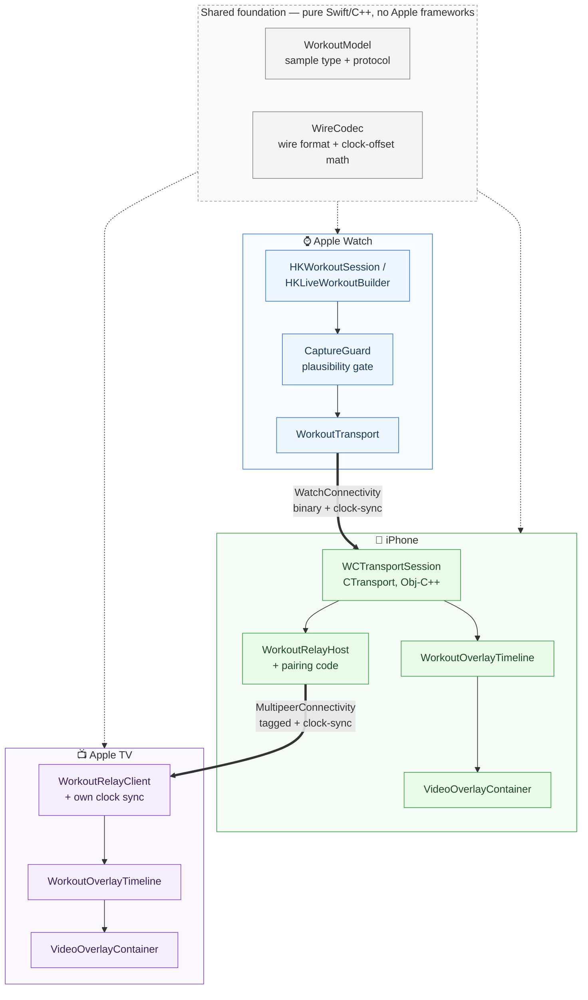

# WorkoutSync

A portfolio project modeling how Apple Fitness+ works end to end: a live
workout on Apple Watch, streamed to a video player on iPhone (and relayed to
Apple TV), rendered as animated overlays — heart-rate ticker, Burn Bar,
closing Activity Ring — synced to the video's own timeline. Built around the
two things a Fitness+ client engineer actually owns: **cross-device
communication** and **rendering live data as a video overlay**.

## Architecture

Every device runs the same pipeline shape — receive, correct the clock,
interpolate, render. The Watch is the only real data source; iPhone and
Apple TV are both just consumers of a corrected stream, so `OverlayKit`'s
rendering code is identical on both.

## Packages

| Package | Platforms | What it does |
|---|---|---|
| `WorkoutModel` | all | `WorkoutSample` type + `WorkoutSampleSource` protocol. Zero dependencies — everything else builds on this. |
| `WireCodec` | all | Wire protocol in pure C++: fixed-size binary encode/decode, and a rolling-median clock-offset estimator. No Apple frameworks, so it's testable anywhere. |
| `TransportKit` | iOS, watchOS | The real Watch↔iPhone link. `CTransport` (Obj-C++) wraps `WCSession`, tags messages so one channel carries both samples and clock-sync pings, and calls into `WireCodec`. Requires WatchConnectivity. |
| `OverlayKit` | iOS, tvOS, macOS | `WorkoutOverlayTimeline` interpolates a ~1/sec sample feed up to 30fps so the UI doesn't stutter. `VideoOverlayContainer` composites the video with the heart-rate/ring/burn-bar views. |
| `RelayKit` | iOS, tvOS, macOS | Gets data to Apple TV, which has no Watch pairing. `WorkoutRelayHost` (iPhone) rebroadcasts over MultipeerConnectivity with a pairing code; `WorkoutRelayClient` (tvOS) runs its own clock-sync and feeds the same `OverlayKit` UI. |
| `CaptureGuard` | all | Live-data plausibility gate on the Watch, before a reading is transmitted. See below for what it does and doesn't touch. |

`Apps/` has three thin targets (`WorkoutSyncWatch`, `WorkoutSyncPhone`,
`WorkoutSyncTV`) wiring the packages together.

## Does this improve data accuracy?

It improves what's **shown live and relayed**, not what HealthKit
**permanently records** — `finishWorkout` still saves whatever the Watch's
real sensors produced, untouched. Editing a user's actual health record
because a reading looked odd would be wrong.

`CaptureGuard` gates the live, transmitted copy instead:

- **`HeartRateQualityGate`** — rejects readings outside human range, and
  rejects rate-of-change no real heart produces (60 BPM/s rise / 30 BPM/s
  fall ceiling — asymmetric because HR recovery is physiologically slower
  than HR onset). A rejected reading doesn't poison the next comparison.
- **`CumulativeMetricGuard`** — holds energy/distance steady rather than
  letting them go backwards on an out-of-order HealthKit callback.
- **`SensorDropoutMonitor`** — flags a stale heart-rate feed so the UI can
  show "checking heart rate…" instead of silently freezing.

Still a client-side UX concern, not sensor science — actually improving how
the Watch *measures* heart rate (PPG signal processing, motion-artifact
rejection) is a different problem owned by Apple's Health team, not the
Fitness+ client team this project targets.

## Setup

1. **Install full Xcode** (Mac App Store, or
   [developer.apple.com](https://developer.apple.com/download/applications)),
   not just Command Line Tools. Run `sudo xcode-select -s /Applications/Xcode.app`
   and open it once. Needs your own Apple ID.
2. Open `WorkoutSync.xcodeproj`, set your Team in each target's Signing &
   Capabilities tab. Edit `project.yml` + re-run `xcodegen generate` for any
   structural change rather than hand-editing the `.xcodeproj`.
3. Drop a video named `sample_workout.mp4` into the `WorkoutSyncPhone` and
   `WorkoutSyncTV` targets (any local mp4 — no licensed Fitness+ content
   ships here). Without it, both apps show a placeholder instead of crashing.

## Running it

- **iPhone**: scheme `WorkoutSyncPhone`. Simulator is fine for UI/layout; a
  **real, Watch-paired iPhone** is needed for live data — WatchConnectivity
  and HealthKit don't behave realistically in the Simulator. The "Simulated
  Data" toggle feeds fabricated data through the real pipeline either way.
- **Watch**: embedded in the `WorkoutSyncPhone` build — installs
  automatically alongside it on a physical, paired iPhone.
- **Apple TV**: scheme `WorkoutSyncTV`. Enter the pairing code shown in the
  iPhone UI (after toggling "Relay to Apple TV") on the TV's connect screen.
  Needs a real network for the Multipeer relay.

## Tests

⌘U in Xcode runs everything. Per-package from the command line:
`cd Packages/<Name> && swift test` — works for everything except
`TransportKit`, which needs an iOS/watchOS destination:
`xcodebuild test -scheme TransportKit -destination 'platform=iOS Simulator,name=iPhone 16'`.

| Package | Tests | Covers |
|---|---|---|
| WorkoutModel | `WorkoutSampleTests` | Codable round trip, equality, a stub `WorkoutSampleSource` |
| WireCodec | `WireCodecTests` | Binary encode/decode + truncation rejection; clock estimator recovers a known offset, resists an outlier |
| OverlayKit | `WorkoutOverlayTimelineTests` | Interpolation, holding last value past the newest sample, buffer eviction, out-of-order ingestion |
| RelayKit | `RelayKitTests` | Wire-tag round trip + garbage rejection; `serviceType` satisfies MultipeerConnectivity constraints |
| TransportKit | `WorkoutSampleWireTests` | `WorkoutSample` round-trips through the Obj-C bridge unchanged |
| CaptureGuard | 3 test files | Plausible changes accepted, spikes/out-of-range rejected without poisoning later readings; cumulative metrics never go backwards; dropout detected and cleared correctly |

All verified for real: every package builds and its tests pass via
`xcodebuild`/`swift test`, all three app targets build clean, and the Phone
app was installed and screenshotted running in the Simulator. That process
caught and fixed several real bugs — a cross-target header import, a
watchOS clock API that silently doesn't exist there, a missing framework
link, a missing `WKCompanionAppBundleIdentifier`, a video view not filling
the screen, and two genuine data races (`WorkoutOverlayTimeline`'s two
unsynchronized `Task`s, and the clock estimator's cross-thread access) —
each re-verified with a full rebuild + test pass afterward.

## Honest gaps

- **Nothing has run on physical hardware yet** — only Simulators. Real
  WatchConnectivity/HealthKit/Multipeer behavior needs a real Watch, iPhone,
  and Apple TV to fully validate.
- **GymKit is not a public API** — Apple restricts it to MFi-certified
  equipment manufacturers. No real "connect to a treadmill" path here.
- `CaptureGuard`'s thresholds are tunable heuristics, not a physiological
  model — real production rejection would likely cross-check accelerometer
  data too.
- The relay's clock-sync falls back to local receipt-time stamping for the
  few seconds before its first sync estimate lands.
- Burn Bar reference value and ring goal energy are passed in as plain
  numbers rather than sourced from workout metadata.
- `sample_workout.mp4` is a synthetic ffmpeg test pattern, not real footage.
